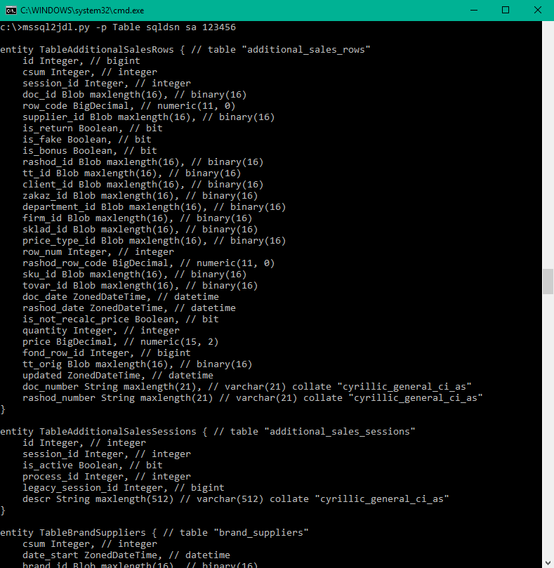

#mssql2jdl

----------------------
Creates JHipster JDL for SQL Server database

##1. Install
```
> pip install git+https://github.com/lelkaklel/mssql2jdl.git
```
or setup manually
```
> python setup.py install
```
##2. Create DSN


##3. Run
```
> mssql2jdl [-p <table_name_prefix>] <sqlserver_dsn_name> <sql_server_user> <sql_server_password> > jhipster-jdl.jh
```


